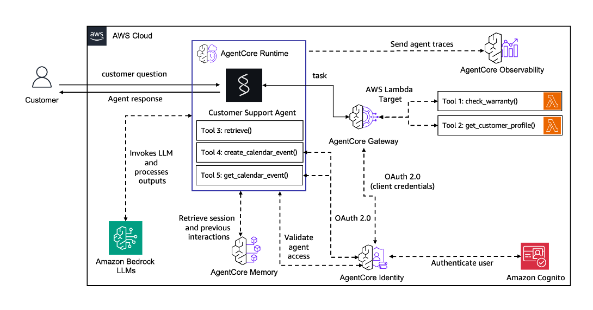
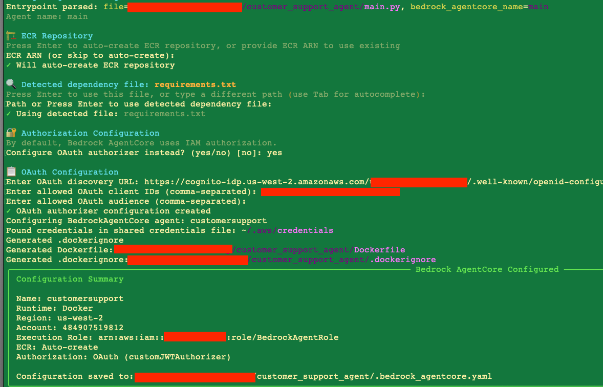
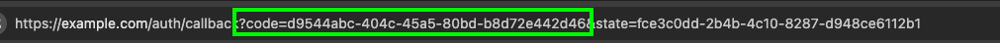

# Customer Support Agent

> [!IMPORTANT]
> The examples provided in this repository are for experimental and educational purposes only. They demonstrate concepts and techniques but are not intended for direct use in production environments.

This is a customer support agent implementation using Amazon Bedrock AgentCore framework. The system provides an AI-powered customer support interface with capabilities for warranty checking, customer profile management, Google calendar integration, and Amazon Bedrock Knowledge Base retrieval.



## AWS Account Setup

1. **AWS Account**: You need an active AWS account with appropriate permissions
   - [Create AWS Account](https://aws.amazon.com/account/)
   - [AWS Console Access](https://aws.amazon.com/console/)

2. **AWS CLI**: Install and configure AWS CLI with your credentials
   - [Install AWS CLI](https://docs.aws.amazon.com/cli/latest/userguide/getting-started-install.html)
   - [Configure AWS CLI](https://docs.aws.amazon.com/cli/latest/userguide/cli-configure-quickstart.html)

   ```bash
   aws configure
   ```

3. **IAM Permissions**: Required IAM permissions for deployment and operation

   Your AWS user or role needs the following permissions to successfully deploy and run this sample:

   ```json
   {
       "Version": "2012-10-17",
       "Statement": [
           {
               "Sid": "AllowS3VectorOperations",
               "Effect": "Allow",
               "Action": [
                   "s3vectors:*"
               ],
               "Resource": "*"
           },
           {
               "Sid": "AllowSSMParameterOperations",
               "Effect": "Allow",
               "Action": [
                   "ssm:PutParameter",
                   "ssm:GetParameter",
                   "ssm:GetParameters",
                   "ssm:GetParametersByPath",
                   "ssm:DeleteParameter",
                   "ssm:DeleteParameters",
                   "ssm:DescribeParameters",
                   "ssm:AddTagsToResource"
               ],
               "Resource": "*"
           },
           {
               "Sid": "AllowDynamoDBOperations",
               "Effect": "Allow",
               "Action": [
                   "dynamodb:DescribeTable",
                   "dynamodb:CreateTable",
                   "dynamodb:DeleteTable",
                   "dynamodb:UpdateTable",
                   "dynamodb:PutItem",
                   "dynamodb:GetItem",
                   "dynamodb:UpdateItem",
                   "dynamodb:DeleteItem",
                   "dynamodb:Query",
                   "dynamodb:Scan",
                   "dynamodb:BatchGetItem",
                   "dynamodb:BatchWriteItem",
                   "dynamodb:DescribeTimeToLive",
                   "dynamodb:UpdateTimeToLive",
                   "dynamodb:TagResource",
                   "dynamodb:UntagResource",
                   "dynamodb:ListTagsOfResource",
                   "dynamodb:UpdateContinuousBackups",
                   "dynamodb:DescribeContinuousBackups"
               ],
               "Resource": "*"
           },
           {
               "Sid": "AllowCognitoOperations",
               "Effect": "Allow",
               "Action": [
                   "cognito-idp:CreateUserPool",
                   "cognito-idp:DeleteUserPool",
                   "cognito-idp:DescribeUserPool",
                   "cognito-idp:UpdateUserPool",
                   "cognito-idp:CreateUserPoolClient",
                   "cognito-idp:DeleteUserPoolClient",
                   "cognito-idp:DescribeUserPoolClient",
                   "cognito-idp:UpdateUserPoolClient",
                   "cognito-idp:CreateGroup",
                   "cognito-idp:DeleteGroup",
                   "cognito-idp:GetGroup",
                   "cognito-idp:UpdateGroup",
                   "cognito-idp:ListGroups",
                   "cognito-idp:CreateResourceServer",
                   "cognito-idp:DeleteResourceServer",
                   "cognito-idp:DescribeResourceServer",
                   "cognito-idp:UpdateResourceServer",
                   "cognito-idp:SetUserPoolMfaConfig",
                   "cognito-idp:TagResource",
                   "cognito-idp:UntagResource",
                   "cognito-idp:ListTagsForResource"
               ],
               "Resource": "*"
           }
       ]
   }
   ```

   **Additional Permissions**: Consider adding the `AmazonBedrockFullAccess` managed policy for complete Amazon Bedrock access.

   **Note**: The permissions above use `"Resource": "*"` for simplicity. In production environments, you should scope these down to specific resources following the principle of least privilege.

4. **Python 3.10+**: Required for running the application
   - [Python Downloads](https://www.python.org/downloads/)

5. **uv**: Modern Python package installer and resolver
   - [Install uv](https://github.com/astral-sh/uv)

   ```bash
   curl -LsSf https://astral.sh/uv/install.sh | sh
   ```

6. **Create OAuth 2.0 credentials for calendar access** : For Google Calendar integration
   - Follow [Google OAuth Setup](./google_oauth_setup.md)

## Deploy

1. **Create infrastructure**

    ```bash
    # Set AWS region (default is us-east-1)
    export AWS_DEFAULT_REGION=us-east-1

    # Install dependencies using uv
    uv sync
    source .venv/bin/activate
    chmod +x scripts/prereq.sh
    ./scripts/prereq.sh

    chmod +x scripts/list_ssm_parameters.sh
    ./scripts/list_ssm_parameters.sh
    ```

    > [!NOTE]
    > The deployment defaults to `us-east-1` region. To deploy to a different region, set the `AWS_DEFAULT_REGION` environment variable before running the scripts. For example, to deploy to `us-west-2`:
    > ```bash
    > export AWS_DEFAULT_REGION=us-west-2
    > ```

    > [!CAUTION]
    > Please prefix all the resource name with `customersupport`.

2. **Create Agentcore Gateway**

    ```bash
    uv run python scripts/agentcore_gateway.py create --name customersupport-gw
    ```

3. **Setup Agentcore Identity**

    - **Setup Cognito Credential Provider**

    ```bash
    uv run python scripts/cognito_credentials_provider.py create --name customersupport-gateways

    uv run python test/test_gateway.py --prompt "Check warranty with serial number MNO33333333"
    ```

    - **Setup Google Credential Provider**

    Follow instructions to setup [Google Credentials](./prerequisite/google_oauth_setup.md).

    ```bash
    uv run python scripts/google_credentials_provider.py create --name customersupport-google-calendar

    uv run python test/test_google_tool.py
    ```

4. **Create Memory**

    ```bash
    uv run python scripts/agentcore_memory.py create --name customersupport

    uv run python test/test_memory.py load-conversation
    uv run python test/test_memory.py load-prompt "My preference of gaming console is V5 Pro"
    uv run python test/test_memory.py list-memory
    ```

5. **Setup Agent Runtime**

> [!CAUTION]
> Please ensure the name of the agent starts with `customersupport`.
    
  ```bash
  agentcore configure --entrypoint main.py -er arn:aws:iam::<Account-Id>:role/<Role> --name customersupport<AgentName>
  ```

  Use `./scripts/list_ssm_parameters.sh` to fill:
  - `Role = ValueOf(/app/customersupport/agentcore/runtime_iam_role)`
  - `OAuth Discovery URL = ValueOf(/app/customersupport/agentcore/cognito_discovery_url)`
  - `OAuth client id = ValueOf(/app/customersupport/agentcore/web_client_id)`.

  

  > [!CAUTION]
  > Please make sure to delete `.agentcore.yaml` before running agentcore launch.

  ```bash

  rm .agentcore.yaml

  agentcore launch

  uv run python test/test_agent.py customersupport<AgentName> -p "Hi"
  ```

  

6. **Local Host Streamlit UI**

> [!CAUTION]
> Streamlit app should only run on port `8501`.

```bash
uv run streamlit run app.py --server.port 8501 -- --agent=customersupport<AgentName>
```

## Sample Queries

1. I have a Gaming Console Pro device , I want to check my warranty status, warranty serial number is MNO33333333.

2. What are the warranty support guidelines ?

3. What’s my agenda for today?

4. Can you create an event to setup call to renew warranty?

5. I have overheating issues  with my device, help me debug.

## Cleanup

```bash
chmod +x scripts/cleanup.sh
./scripts/cleanup.sh

uv run python scripts/google_credentials_provider.py delete
uv run python scripts/cognito_credentials_provider.py delete
uv run python scripts/agentcore_memory.py delete
uv run python scripts/agentcore_gateway.py delete
uv run python scripts/agentcore_agent_runtime.py customersupport<AgentName>

rm .agentcore.yaml
rm .bedrock_agentcore.yaml
```
