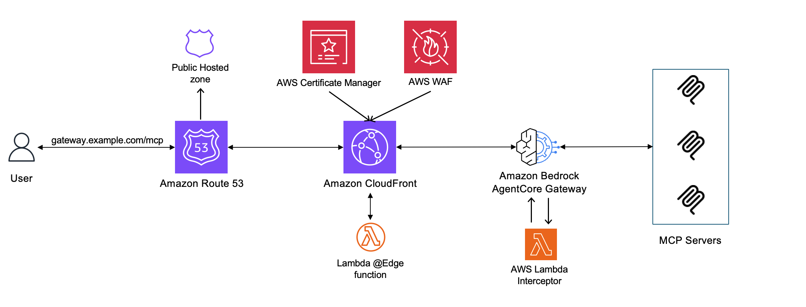

# Custom Domains for Amazon Bedrock AgentCore Gateway

As organizations deploy AI agents at scale using Amazon Bedrock AgentCore Gateway, a common requirement emerges: exposing gateway endpoints through custom domain names that align with corporate branding and security standards. While AgentCore Gateway provides a fully managed MCP endpoint, production deployments often need custom domains (for example, `mcp.example.com`) along with enterprise-grade security controls such as WAF protection, geo-restrictions, access logging, and OAuth discovery compatibility.

## Architecture



## What gets deployed

| Resource | Purpose |
|----------|---------|
| Route 53 A record | Alias record pointing custom domain to CloudFront |
| ACM certificate | TLS certificate with DNS validation via Route 53 |
| CloudFront distribution | Reverse proxy with three behaviors (default, `/mcp`, `/.well-known/*`) |
| AWS WAF Web ACL | Common rules, known bad inputs, rate limiting (2,000 req/5 min per IP) |
| Lambda@Edge (OAuth rewrite) | Rewrites `/.well-known/oauth-protected-resource` to reflect custom domain |
| Lambda@Edge (WWW-Authenticate rewrite) | Rewrites `WWW-Authenticate` header on 401 responses per RFC 9728 |
| Lambda (origin verify interceptor) | REQUEST interceptor to validate traffic passes through CloudFront |
| Secrets Manager secret | Auto-generated origin verification header value |
| S3 bucket | CloudFront access logs with 90-day lifecycle, encryption, SSL enforced |
| SNS topic | Alarm notifications for 5xx (>5%) and 4xx (>20%) error rates |
| CloudWatch alarms | Monitors CloudFront error rates, publishes to SNS |

## Prerequisites

Before getting started, verify you have the following:

- Amazon Bedrock AgentCore Gateway, refer to this [getting started guide](https://docs.aws.amazon.com/bedrock-agentcore/latest/devguide/gateway-quick-start.html).  
- A registered domain name (for example, through Amazon Route 53 or an external registrar)
- [AWS CDK](https://docs.aws.amazon.com/cdk/v2/guide/getting-started.html) installed and configured
- [AWS CLI](https://docs.aws.amazon.com/cli/latest/userguide/cli-chap-getting-started.html) configured with appropriate IAM permissions for CloudFront, Route 53, ACM, WAF, S3, SNS, and Lambda
- [Python 3.12](https://www.python.org/downloads/) or later

## Setup

### Step 1: Set up DNS delegation 

If your domain is registered with an external registrar, you can delegate a subdomain to Route 53 without moving your entire domain. Create a public hosted zone in Route 53 for your subdomain (for example, `mcp.example.com`). Route 53 provides four nameserver (NS) records. Add NS records at your registrar pointing the subdomain to Route 53's nameservers:

```bash

dig mcp.example.com NS +short 

```

You should see the four Route 53 nameservers returned.

### Step 2: Deploy the CDK stack

Create and activate a virtual environment, then install dependencies:

```bash
git clone 

cd  
python3 -m venv .venv
source .venv/bin/activate
pip install -r requirements.txt
```

Provide three required context parameters. You can set them in `cdk.context.json`:

```json
{
  "domain_name": "mcp.example.com",
  "authorization_server": "https://your-auth-server.com",
  "gateway_hostname": "your-gateway.gateway.bedrock-agentcore.us-west-2.amazonaws.com"
}
```

Or pass them via the CLI:

```bash
cdk deploy \
  -c domain_name=mcp.example.com \
  -c authorization_server=https://your-auth-server.com \
  -c gateway_hostname=your-gateway.gateway.bedrock-agentcore.us-west-2.amazonaws.com
```

| Parameter | Description |
|-----------|-------------|
| `domain_name` | Your custom domain (must match a Route 53 hosted zone) |
| `authorization_server` | OAuth authorization server URL for your gateway |
| `gateway_hostname` | AgentCore Gateway hostname (without protocol or path) |

```bash
cdk deploy
```

> **Note:** The stack must be deployed to `us-east-1` because CloudFront requires ACM certificates and WAF Web ACLs in that Region. Lambda@Edge functions are also deployed to `us-east-1` and replicated globally by CloudFront.

## Stack outputs

After deployment, the stack provides the following outputs:

| Output | Description |
|--------|-------------|
| `DistributionDomain` | CloudFront distribution domain name |
| `CustomDomain` | Your custom MCP endpoint URL |
| `AlarmTopicArn` | SNS topic ARN for error rate alarms |
| `OriginVerifyHeader` | Custom origin header name (`X-AgentCore-Origin-Verify`) |
| `OriginVerifySecretArn` | Secrets Manager ARN for the origin verification value |
| `OriginVerifyInterceptorArn` | Lambda ARN for the gateway REQUEST interceptor |

Retrieve the origin verification secret value:

```bash
aws secretsmanager get-secret-value \
  --secret-id <OriginVerifySecretArn> \
  --query SecretString --output text
```

## Post-deployment steps

### Configure the origin verification interceptor

Custom origin headers are configured on the CloudFront origin to verify that all traffic reaching Amazon Bedrock AgentCore Gateway passes through Amazon CloudFront. This prevents anyone from bypassing WAF and other edge protections by calling the AgentCore Gateway endpoint directly.

To enforce this validation, configure the `OriginVerifyInterceptor` Lambda (or your own Lambda with the logic from `lambda/origin_verify/index.py`) as a REQUEST interceptor on your AgentCore Gateway with `passRequestHeaders` enabled. Set two environment variables on the Lambda function: `ORIGIN_VERIFY_HEADER` and `ORIGIN_VERIFY_VALUE`. Retrieve the header name from the `OriginVerifyHeader` stack output. Retrieve the secret value from AWS Secrets Manager using the `OriginVerifySecretArn` stack output:

```bash
aws secretsmanager get-secret-value \
  --secret-id <OriginVerifySecretArn> \
  --query SecretString --output text
```

### Subscribe to the SNS alarm topic (optional)

Subscribe to receive notifications when CloudFront error rate alarms trigger:

```bash
aws sns subscribe \
  --topic-arn <AlarmTopicArn> \
  --protocol email \
  --notification-endpoint your-team@example.com
```

Check your inbox and confirm the subscription. You can also subscribe HTTPS webhooks, SQS queues, or Lambda functions.

### Configure your MCP client

Point your MCP client to the custom domain:

```json
{
  "mcpServers": {
    "my-gateway": {
      "url": "https://mcp.example.com/mcp"
    }
  }
}
```

## Verify deployment

### DNS resolution

```bash
dig mcp.example.com +short
```

You should see CloudFront IP addresses returned.

### TLS certificate

```bash
curl -v https://mcp.example.com 2>&1 | grep "subject:"
```

Confirm the certificate shows your custom domain issued by Amazon.

### OAuth discovery

```bash
curl https://mcp.example.com/.well-known/oauth-protected-resource
```

Expected response:

```json
{
  "authorization_servers": ["https://your-auth-server.com"],
  "resource": "https://mcp.example.com/mcp"
}
```

### WWW-Authenticate header

```bash
curl -X POST https://mcp.example.com/mcp \
  -H "Content-Type: application/json" -d '{}'
```

The 401 response should include:

```
WWW-Authenticate: Bearer resource_metadata="https://mcp.example.com/.well-known/oauth-protected-resource"
```

## Security controls

| Control | Component | Purpose |
|---------|-----------|---------|
| TLS 1.2+ | CloudFront + ACM | Encrypted connections end-to-end |
| WAF Common Rules | AWS WAF | Protection against OWASP Top 10 exploits |
| WAF Bad Inputs | AWS WAF | Block known malicious request patterns |
| Rate limiting | AWS WAF | 2,000 requests per 5 min per IP |
| Geo-restriction | CloudFront | Allowlist approved countries only |
| Origin verification | Secrets Manager + CloudFront + Lambda interceptor | Verify traffic comes through CloudFront |
| OAuth rewrite | Lambda@Edge | Correct OAuth discovery for custom domain |
| WWW-Authenticate rewrite | Lambda@Edge | Correct 401 metadata URL per RFC 9728 |
| Access logging | CloudFront + S3 | Request-level audit trail (90-day retention) |
| Error rate alerting | CloudWatch + SNS | Alerting on 4xx and 5xx error spikes |

## Cleanup

To remove all resources created by this stack:

```bash
cdk destroy
```

**Note the following:**

- The **ACM certificate** has `RemovalPolicy.RETAIN` and will not be deleted by `cdk destroy`. Delete it manually in the ACM console (`us-east-1`) if no longer needed.
- **Lambda@Edge replicas** are distributed to CloudFront edge locations and take 30-60 minutes to clean up after the distribution is deleted. If `cdk destroy` fails on the Lambda@Edge functions, wait and retry.
- The **Secrets Manager secret** will be scheduled for deletion with a default 30-day recovery window. To delete immediately, use:

  ```bash
  aws secretsmanager delete-secret \
    --secret-id <OriginVerifySecretArn> \
    --force-delete-without-recovery
  ```

- The **S3 access logs bucket** must be empty before it can be deleted. If the bucket contains log objects, empty it first:

  ```bash
  aws s3 rm s3://<bucket-name> --recursive
  ```

- Remove the **gateway REQUEST interceptor** configuration from your AgentCore Gateway to avoid rejected requests after the origin verification secret is deleted.

## Useful commands

| Command | Description |
|---------|-------------|
| `cdk synth` | Synthesize the CloudFormation template |
| `cdk deploy` | Deploy the stack |
| `cdk diff` | Compare deployed stack with current state |
| `cdk destroy` | Tear down the stack |
